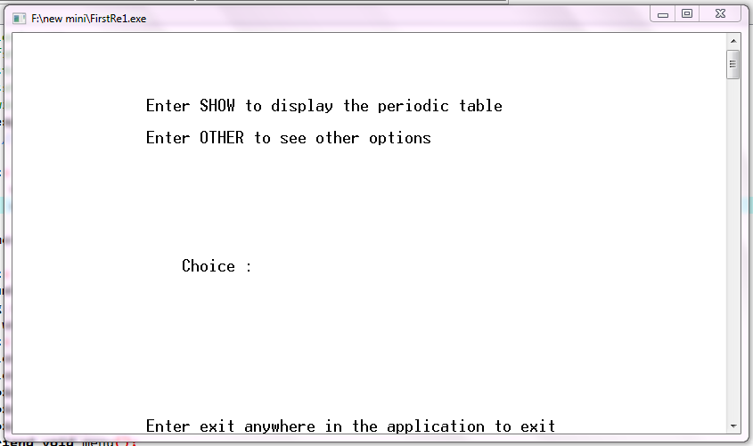
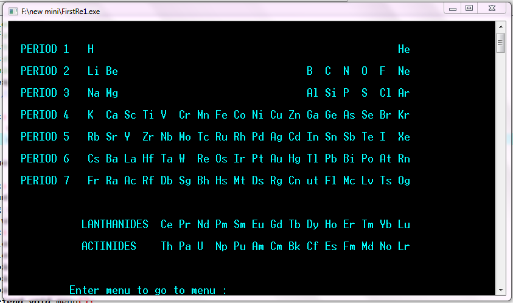
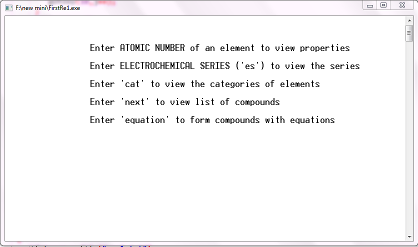
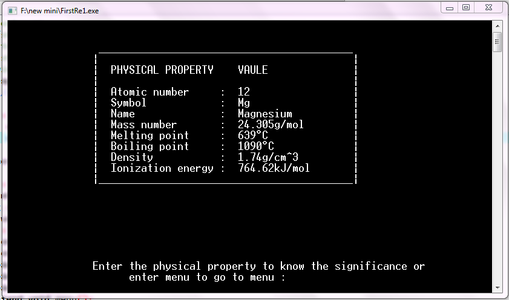
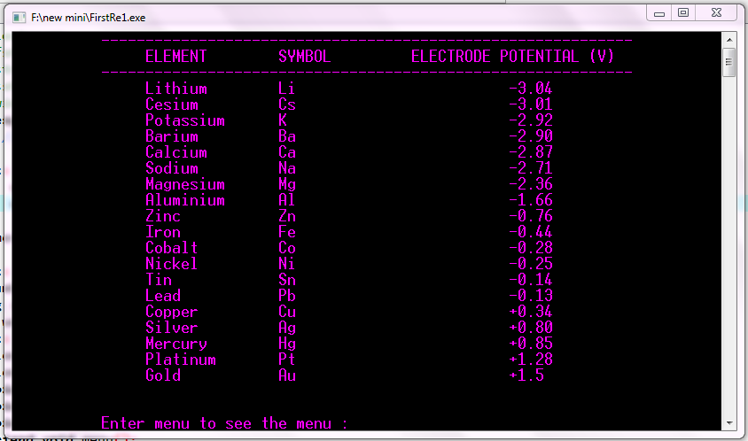
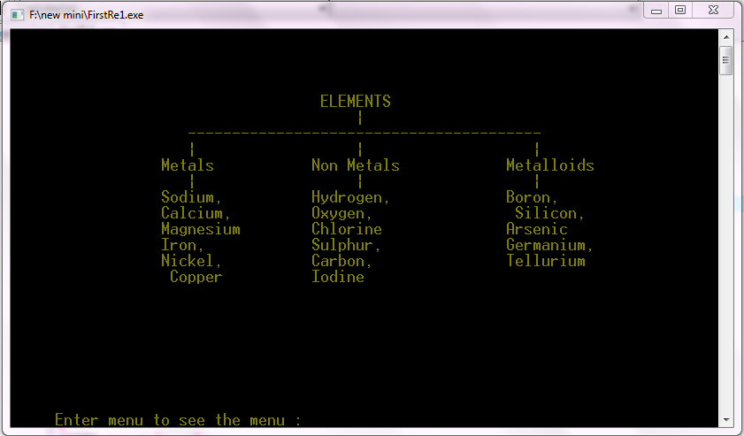
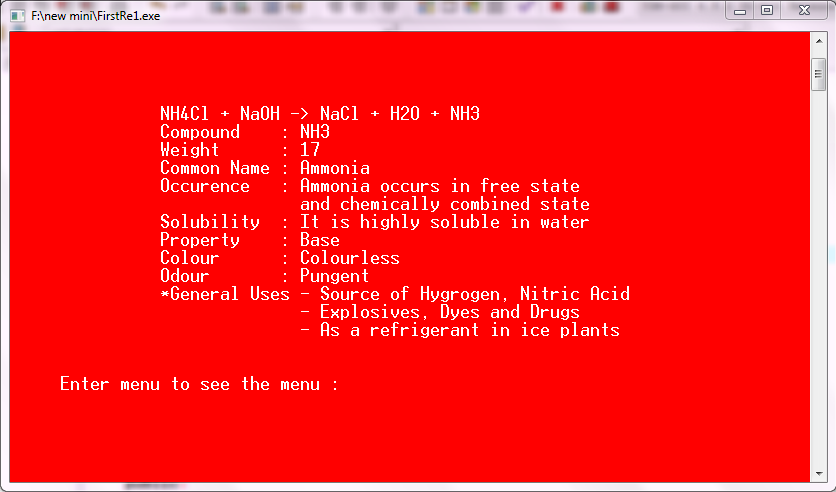

# **Periodic-Table**
A basic C++ application to display the periodic table and some properties of each element.

Dated: Jan-May 2016

## **Objective**
* The main objective of creating this application is to provide convenience to users when studying about the elements found on the periodic table by providing the necessary details about each element.
* This project also aims in providing the users accurate information of elements and compounds easily.

## **Contents of the application**
* Viewing of the periodic table
* Viewing of each element’s details by atomic number.
* Viewing of Electrochemical series.
* Display of categories of elements.
* Displays properties of some compounds.
* Accepts equations to fully balance it and display the details if the element formed.

Attached are some screenshots from the application:

*Main menu*

*Display of the standard periodic table*

*Sub-menu*

*Description of a single element*

*Elements with their respective electrode potential*

*General categories of elements*

*Extensive details of the particular element*

